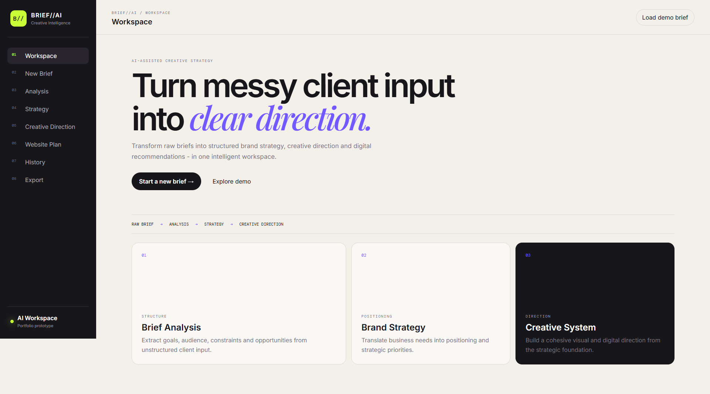
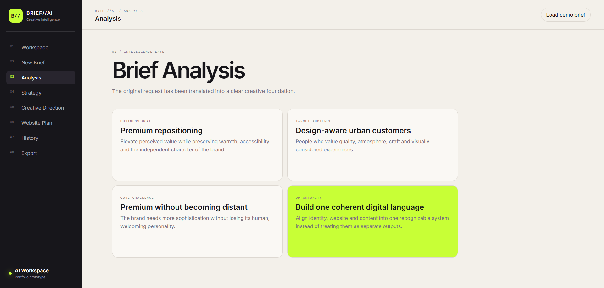
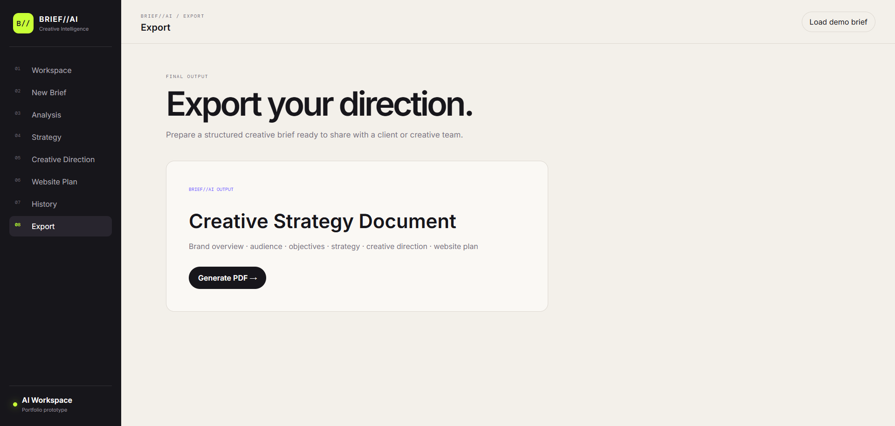
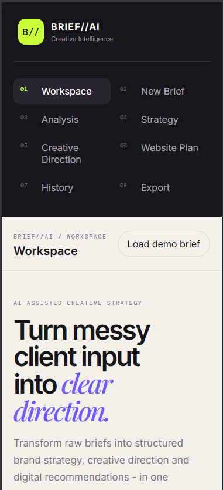

# BRIEF//AI — Creative Intelligence


[Live Demo](https://brief-ai-gamma.vercel.app) · [View Repository](https://github.com/Lambertiny/brief-ai)

AI-assisted creative briefing workspace that transforms raw client input into structured brand strategy, creative direction and digital recommendations.

BRIEF//AI was designed as a product-design and front-end portfolio case exploring how artificial-intelligence workflows can support creative strategy.

---

## Project Highlights

- Structured creative briefing workflow
- Raw client input editor
- Brief analysis interface
- Brand strategy recommendations
- Creative direction system
- Website planning module
- Project history interface
- Responsive desktop and mobile experience
- Real PDF strategy-document generation
- Multi-page formatted PDF export
- Interactive navigation and application states

---

## Product Flow

```text
RAW CLIENT BRIEF
        ↓
ANALYSIS
        ↓
STRATEGY
        ↓
CREATIVE DIRECTION
        ↓
WEBSITE PLAN
        ↓
PDF EXPORT
```

---

## Screenshots

### Workspace



### New Brief


### Analysis



### Export & PDF Generation



### Responsive Mobile Experience

<p align="center">
  
</p>

---

## Main Areas

### Workspace

Central overview of the BRIEF//AI creative-intelligence workflow.

### New Brief

Workspace for entering raw client messages, meeting notes or unstructured project information.

### Analysis

Transforms the briefing into structured signals such as:

- Business goal
- Target audience
- Core challenge
- Strategic opportunity

### Strategy

Organizes:

- Positioning
- Brand personality
- Priorities
- Differentiators

### Creative Direction

Defines recommendations for:

- Typography
- Color palette
- Imagery
- Motion and interaction

### Website Plan

Creates a suggested information architecture for the digital experience.

### History

Demonstrates an archive interface for previous creative explorations.

### Export

Generates a formatted multi-page **Creative Strategy PDF** ready for presentation or sharing.

---

## PDF Generation

BRIEF//AI uses `jsPDF` to generate a real downloadable strategy document directly in the browser.

The exported PDF includes:

- Original client brief
- Strategic signals
- Brand strategy
- Creative direction
- Website plan
- Recommended next steps
- Automatic page numbering
- BRIEF//AI visual identity

---

## Tech Stack

- React
- Vite
- JavaScript
- CSS
- jsPDF
- ESLint

---

## Run Locally

Install dependencies:

```bash
npm install
```

Start the development server:

```bash
npm run dev
```

On Windows PowerShell, if script execution blocks `npm`, use:

```bash
npm.cmd install
npm.cmd run dev
```

Then open the local Vite URL shown in the terminal.

---

## Portfolio Note

BRIEF//AI is a fictional product created as a portfolio case study to demonstrate product design, UI/UX, front-end development, responsive interface design, creative workflow architecture and document-generation functionality.

The current portfolio version uses simulated strategic outputs to demonstrate the complete product experience. No external AI API or private API key is exposed in this public repository.

---

## Usage & Rights

© 2026 Juliana Nascimento. All rights reserved.

This project is publicly available for portfolio demonstration and evaluation purposes.

The source code, interface design, visual identity and project materials may not be commercially reused, redistributed, republished or presented as original work without prior written permission.
