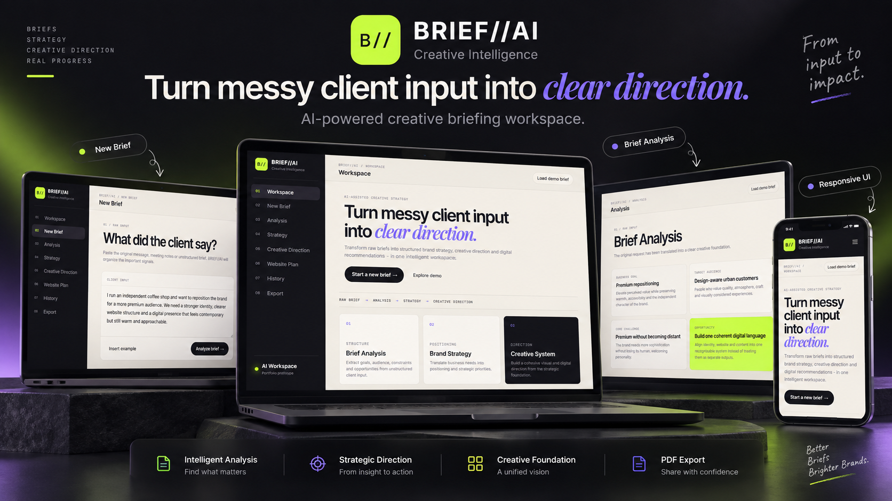

# BRIEF//AI — Creative Intelligence



[Live Demo](https://brief-ai-gamma.vercel.app) · [View Repository](https://github.com/Lambertiny/brief-ai)

AI-assisted creative briefing workspace that transforms raw client input into structured brand strategy, creative direction and digital recommendations.

BRIEF//AI was designed as a product-design and front-end portfolio case exploring how artificial-intelligence workflows can support creative strategy.

---

## Project Highlights

- Structured creative briefing workflow
- Raw client input editor
- Brief analysis interface
- Brand strategy recommendations
- Creative direction system
- Website planning module
- Project history interface
- Responsive desktop and mobile experience
- Real PDF strategy-document generation
- Multi-page formatted PDF export
- Interactive navigation and application states

---

## Product Flow

```text
RAW CLIENT BRIEF
        ↓
ANALYSIS
        ↓
STRATEGY
        ↓
CREATIVE DIRECTION
        ↓
WEBSITE PLAN
        ↓
PDF EXPORT
